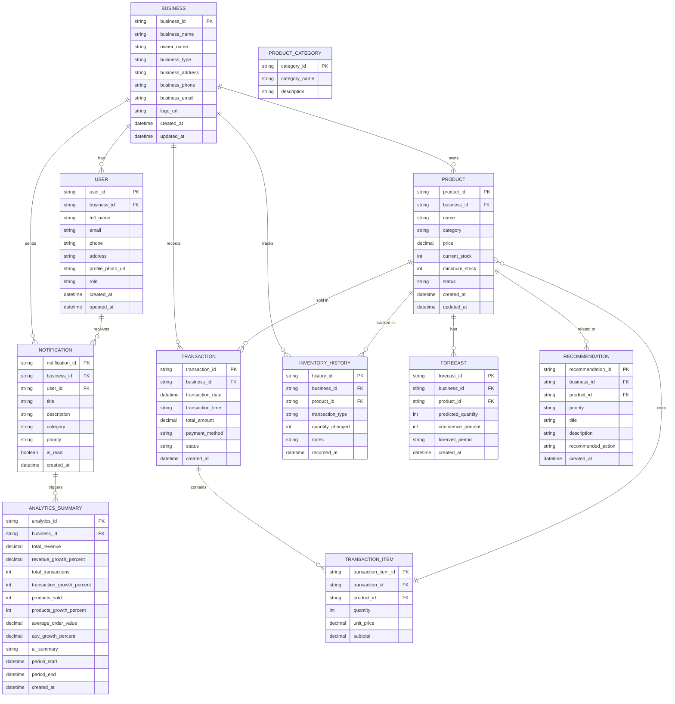

# Entity Relationship Diagram (ERD) - UMKM Smart Advisor

## Database Schema Overview



## Table Descriptions

### BUSINESS
Main business account entity
- **business_id**: Unique identifier
- **business_name**: Name of the business
- **owner_name**: Name of business owner
- **business_type**: Type of business (Coffee Shop, etc.)
- **business_address**: Physical address
- **business_phone**: Contact phone number
- **business_email**: Contact email
- **logo_url**: URL to business logo

### USER
Users associated with the business
- **user_id**: Unique identifier
- **business_id**: Foreign key to BUSINESS
- **full_name**: User's full name
- **email**: User's email
- **phone**: User's phone number
- **address**: User's address
- **profile_photo_url**: URL to profile photo
- **role**: User role (owner, manager, staff)

### PRODUCT
Products managed by the business
- **product_id**: Unique identifier
- **business_id**: Foreign key to BUSINESS
- **name**: Product name
- **category**: Product category (Minuman, Makanan, etc.)
- **price**: Selling price in IDR
- **current_stock**: Current inventory level
- **minimum_stock**: Minimum threshold for restock alert
- **status**: Current status (Available, Low Stock, Out of Stock)

### TRANSACTION
Individual sales transactions
- **transaction_id**: Unique identifier
- **business_id**: Foreign key to BUSINESS
- **transaction_date**: Date of transaction
- **transaction_time**: Time of transaction
- **total_amount**: Total amount in IDR
- **payment_method**: Payment method (Cash, QRIS, Card, etc.)
- **status**: Transaction status (Selesai, Pending, Failed)

### TRANSACTION_ITEM
Line items within a transaction (junction table)
- **transaction_item_id**: Unique identifier
- **transaction_id**: Foreign key to TRANSACTION
- **product_id**: Foreign key to PRODUCT
- **quantity**: Quantity of product sold
- **unit_price**: Price per unit at time of sale
- **subtotal**: Quantity × unit_price

### INVENTORY_HISTORY
Tracks inventory changes over time
- **history_id**: Unique identifier
- **business_id**: Foreign key to BUSINESS
- **product_id**: Foreign key to PRODUCT
- **transaction_type**: Type of transaction (Sale, Restock, Adjustment)
- **quantity_changed**: Amount added/removed
- **notes**: Additional notes
- **recorded_at**: Timestamp of change

### NOTIFICATION
System notifications for users
- **notification_id**: Unique identifier
- **business_id**: Foreign key to BUSINESS
- **user_id**: Foreign key to USER (recipient)
- **title**: Notification title
- **description**: Notification content
- **category**: Category (inventory, sales, payment, recommendation)
- **priority**: Priority level (high, medium, low)
- **is_read**: Whether notification has been read

### FORECAST
AI predictions for product demand
- **forecast_id**: Unique identifier
- **business_id**: Foreign key to BUSINESS
- **product_id**: Foreign key to PRODUCT
- **predicted_quantity**: Predicted units to sell
- **confidence_percent**: AI confidence level (0-100)
- **forecast_period**: Period being forecasted (day, week)

### RECOMMENDATION
AI-generated recommendations for business optimization
- **recommendation_id**: Unique identifier
- **business_id**: Foreign key to BUSINESS
- **product_id**: Foreign key to PRODUCT (optional)
- **priority**: Priority level (HIGH, MEDIUM, LOW)
- **title**: Recommendation title
- **description**: Detailed description
- **recommended_action**: Suggested action to take

### ANALYTICS_SUMMARY
Aggregated business analytics
- **analytics_id**: Unique identifier
- **business_id**: Foreign key to BUSINESS
- **total_revenue**: Total revenue for period
- **revenue_growth_percent**: Growth compared to previous period
- **total_transactions**: Total number of transactions
- **transaction_growth_percent**: Growth in transaction count
- **products_sold**: Total units sold
- **products_growth_percent**: Growth in units sold
- **average_order_value**: Average value per transaction
- **aov_growth_percent**: AOV growth
- **ai_summary**: AI-generated summary text
- **period_start**: Start date of reporting period
- **period_end**: End date of reporting period

### PRODUCT_CATEGORY
Reference table for product categories
- **category_id**: Unique identifier
- **category_name**: Category name
- **description**: Category description

## Key Relationships

1. **One Business : Many Users** - Each business can have multiple users (owner, staff)
2. **One Business : Many Products** - Each business manages multiple products
3. **One Business : Many Transactions** - Business records multiple sales transactions
4. **One Transaction : Many Items** - Each transaction can contain multiple products
5. **One Product : Many Transactions** - Products are sold in multiple transactions
6. **One Product : Many Forecasts** - AI generates multiple forecasts per product
7. **One Product : Many Recommendations** - Multiple recommendations can relate to a product
8. **One Business : Many Notifications** - Business sends notifications to users
9. **One Product : Many Inventory History** - Track complete history of each product

## Data Flow

```
Customer Purchase → TRANSACTION → TRANSACTION_ITEM → Updates PRODUCT.current_stock
                                                   → Creates INVENTORY_HISTORY entry
                                                   → Triggers ANALYTICS_SUMMARY update
                                                   → May trigger NOTIFICATION (low stock alert)

Product Data → FORECAST (AI predictions)
            → RECOMMENDATION (AI suggestions)
            → NOTIFICATION (to alert users)

System monitors → Generates ANALYTICS_SUMMARY
              → Triggers RECOMMENDATION
              → Creates NOTIFICATION
```

## Indexing Strategy

```sql
-- Performance Indexes
CREATE INDEX idx_transaction_business_date ON TRANSACTION(business_id, transaction_date);
CREATE INDEX idx_product_business_category ON PRODUCT(business_id, category);
CREATE INDEX idx_inventory_history_product ON INVENTORY_HISTORY(product_id, recorded_at);
CREATE INDEX idx_notification_user_read ON NOTIFICATION(user_id, is_read);
CREATE INDEX idx_forecast_product_period ON FORECAST(product_id, forecast_period);
```

## Notes

- All timestamps use UTC timezone
- Prices stored in Indonesian Rupiah (IDR)
- Status fields use enumeration types for consistency
- Soft deletes can be implemented by adding `deleted_at` timestamp columns
- Historical data for analytics should be periodically archived
